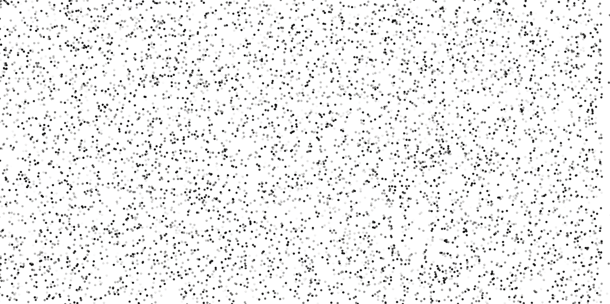
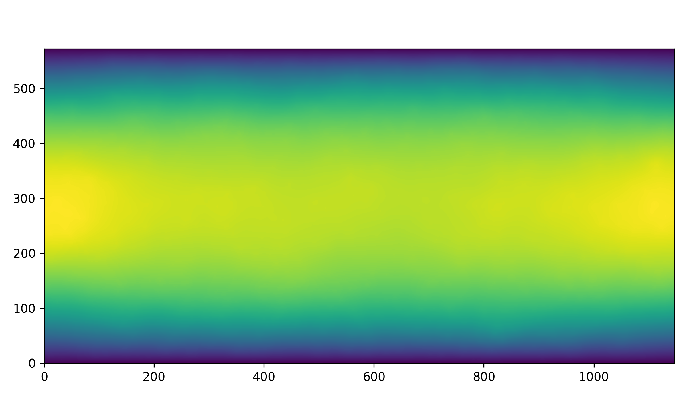

# Optical Flow

This is an example for computing a velocity field as solution of the optical flow problem from a series of images using dune-fem.

## Mathematical model

Let $\Omega \subset \mathbb{R}^d$ and color values $c: \Omega \to \mathbb{R}$ be given. The optical flow problem reads as follows.

Find $\mathbf{v}: \Omega \to \mathbb{R}^d$ that minimizes

$E = \int_\Omega (c_t + \nabla c \cdot \mathbf{v})^2 dx$.

### Horn-Schunck
As the problem above is not well-posed, we use Horn-Schunck's method and add smoothness to the problem

$E = \int_\Omega (c_t + \nabla c \cdot \mathbf{v})^2 + \alpha^2 \| \nabla \mathbf{v} \| dx$.

It can be derived that the minimizer satisfies

$(c_t + \nabla c \cdot \mathbf{v}) \nabla c - \alpha^2 \Delta \mathbf{v} = 0$

which forms the PDE that we solve in our implementation.


## Installation

In order to run the code, you need [dune-fem](https://www.dune-project.org/sphinx/content/sphinx/dune-fem/installation.html) and its dependencies, as well as numpy and matplotlib.

In short, you need Python3 and a C++17 compatible toolchain and just run
 ````
python3 -m venv dune-env
source dune-env/bin/activate
````
to setup a virtual environment.

Install `dune-fem` and `matplotlib` by executing
````
pip install dune-fem matplotlib
````
If you encounter any errors make sure to match all requirements of dune-fem, e.g., OpenMPI, pkg-config and SuiteSparse.

Now, you should be able to run the script
````
python postprocess.py
````

## Example

We use manufactured particle tracer data as an example.




The resulting velocity field looks like the following.



